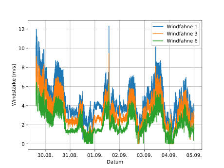
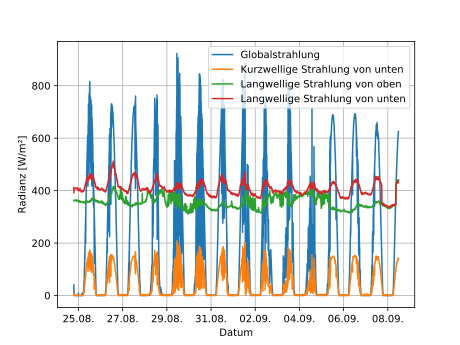
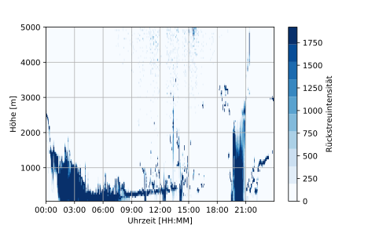

[](https://travis-ci.org/lkluft/lehrex)

# lehrex
Python package to support the research during the annual Lehrexkursion at
Universität Hamburg.

## Table of Contents
* [Installation](#installation)
  * [Stable release](#stable-release)
  * [Development](#development)
* [Package structure](#package-structure)
* [Examples](#examples)

## Installation
### Stable release
For standard Python installations, install the latest stable version using `pip`:
```bash
pip install lehrex
```

### Development
If you want to do changes to the package, clone the repository and install the
package locally:
```bash
git clone https://github.com/lkluft/lehrex.git
cd lehrex
pip install --user --no-deps -e .
```

## Package structure
* `lehrex.csv`: Functions to read and write CSV files (e.g. `MASTER.txt`).
* `lehrex.math`: Basic statistical functions (e.g. `moving_average`, `rmse`).
* `lehrex.plots`: General plotting routines like timeseries or heatmaps.
* `lehrex.utils`: Basic utility functions (e.g. combining data dictionaries).

## Examples
The most common use case is reading data files into `pd.DataFrame`:
```python
import lehrex as lex

dataframe = lex.read('MASTER.txt')
```

The repository contains several [examples](examples) to show some more advanced
applications. Resulting [plots](examples/plots) are also included.
* [Plot radiation measurements](examples/plot_radiation.py)

  

* [Plot wind profile measurements](examples/plot_wind.py)

  

* [Combine several timeseries](examples/combine_timeseries.py)

  

* [Plot ceilometer back scattering (2D)](examples/plot_ceilometer.py)

  
